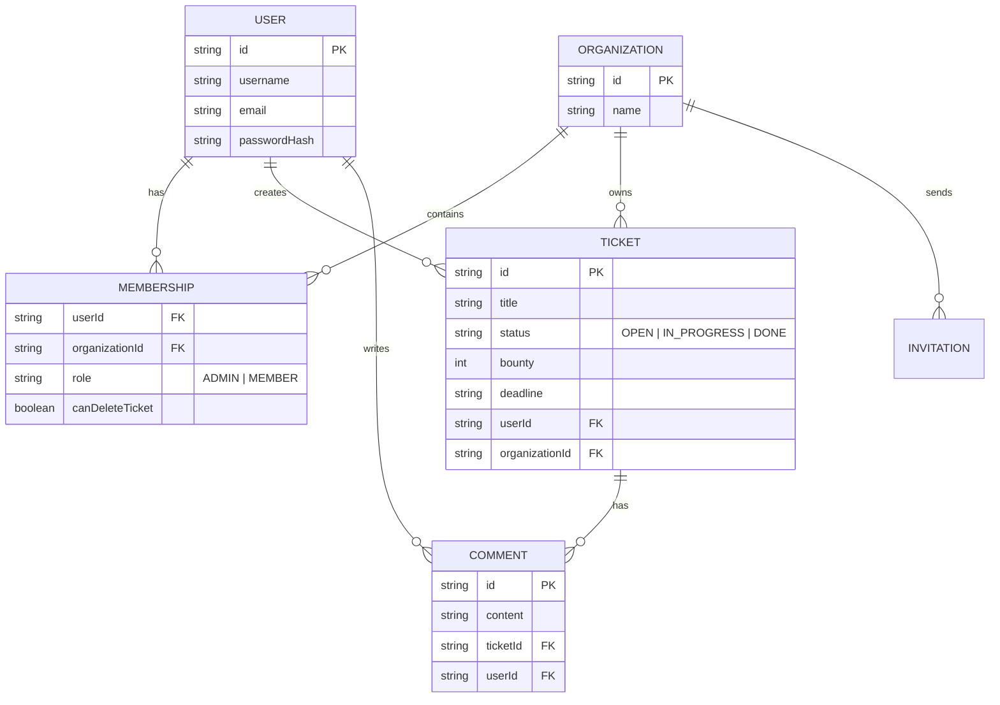

# Database Schema & Data Models

## 1. Gambaran Umum (Database Overview)
Database menggunakan PostgreSQL dengan Prisma sebagai ORM. Skema dirancang untuk mendukung sistem multi-organisasi (multi-tenancy) di mana satu pengguna dapat menjadi bagian dari banyak organisasi, dan setiap organisasi memiliki asetnya sendiri (tiket, anggota, dll).

## 2. Model Entitas Utama (Main Entities)

### 2.1. User & Authentication
- **User:** Menyimpan informasi dasar profil, email terverifikasi, dan password hash.
- **Session:** Mengelola sesi aktif pengguna (Lucia Auth).
- **Verification Tokens:** Digunakan untuk proses verifikasi email dan reset password.

### 2.2. Organization & Membership
- **Organization:** Unit kerja utama dalam aplikasi. Memiliki nama dan daftar anggota.
- **Membership:** Tabel relasi (Pivot) antara User dan Organization. Menyimpan peran (`MEMBER` atau `ADMIN`) dan izin khusus (misal: `canDeleteTicket`).
- **Invitation:** Menyimpan data undangan yang dikirim ke email tertentu untuk bergabung ke organisasi.

### 2.3. Ticketing System
- **Ticket:** Entitas inti yang berisi judul, isi/deskripsi, status (`OPEN`, `IN_PROGRESS`, `DONE`), bounty, dan tenggat waktu (deadline).
- **Comment:** Memungkinkan diskusi kolaboratif di dalam satu tiket. Terhubung dengan User (penulis) dan Ticket.

## 3. Skema Relasi (Entity Relationship Diagram)

## 4. Integritas Data
- **Cascading Delete:** Sebagian besar relasi menggunakan `onDelete: Cascade`. Misalnya, jika sebuah Tiket dihapus, semua Komentar di dalamnya akan otomatis terhapus untuk menjaga konsistensi database (lihat `schema.prisma`).
- **Indexing:** Field yang sering digunakan untuk pencarian/filtering (seperti `userId`, `organizationId`, dan `ticketId`) telah diberi index untuk meningkatkan performa query.
